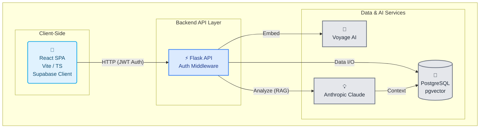

# Remember
**Secure, AI-powered personal memory journal**  
React/Flask app for documenting memories with AI analysis and semantic search via vector embeddings. Uses Supabase for auth, PostgreSQL/pgvector for storage, Voyage AI for embeddings, and Anthropic Claude for analysis.


## Architecture
```
remember/
├── backend/                  # Flask API and associated logic
│   ├── migrations/           # Database migration scripts (Alembic)
│   ├── middleware/
│   │   └── auth_middleware.py # Verifies Supabase JWT tokens
│   ├── models/
│   │   └── __init__.py       # SQLAlchemy database models (UserProfile, Memory, etc.)
│   ├── routes/
│   │   ├── insights.py       # API endpoints for AI analysis and semantic search
│   │   └── memories.py       # API endpoints for CRUD operations on memories
│   ├── services/
│   │   └── embedding_service.py # Generates embeddings using Voyage AI
│   ├── __init__.py
│   ├── app.py                # Flask application factory
│   └── config.py             # Configuration loading (from .env)
│
├── frontend/                 # React client application (Vite + TypeScript)
│   ├── public/               # Static assets
│   ├── src/
│   │   ├── assets/           # Images, etc. (currently empty)
│   │   ├── components/
│   │   │   └── auth/
│   │   │       └── Login.tsx # Login form component
│   │   ├── contexts/
│   │   │   └── AuthContext.tsx # Manages Supabase authentication state
│   │   ├── pages/
│   │   │   ├── AddMemory.tsx   # Page/form for creating a new memory
│   │   │   ├── Analyze.tsx     # Page for AI analysis interface
│   │   │   └── ViewMemories.tsx# Page for displaying/managing memories
│   │   ├── services/
│   │   │   ├── api.ts          # Axios instance configured for backend API calls
│   │   │   ├── encryptionService.ts # Placeholder for client-side encryption
│   │   │   └── supabaseClient.ts # Initializes Supabase client
│   │   ├── App.css           # Minimal App-specific styles
│   │   ├── App.tsx           # Root component with routing (BrowserRouter, Routes)
│   │   ├── index.css         # Global CSS styles and variables
│   │   └── main.tsx          # Application entry point, renders App with AuthProvider
│   ├── .gitignore
│   ├── eslint.config.js      # ESLint configuration
│   ├── index.html            # Main HTML entry point for Vite
│   ├── package-lock.json
│   ├── package.json
│   ├── README.md             # Default Vite README for frontend specifics
│   ├── tsconfig.app.json
│   ├── tsconfig.json
│   └── tsconfig.node.json
│   └── vite.config.ts        # Vite configuration (plugins, aliases)
│
├── .env                      # **critical** Backend environment variables
├── .gitignore                # Root gitignore
└── reqs.txt                  # Python dependencies for Flask API
```
